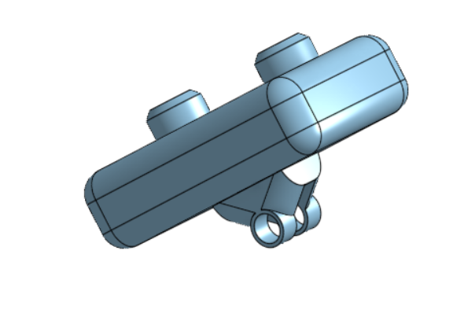

# PI-Pixel

PI-Pixel is my Raspberry Pi Zero 2 W camera build. It is built like a tiny Linux camera instead of a locked-down gadget, so the firmware runs as a normal Python script on boot, saves photos to the SD card, and keeps the whole thing easy to hack on.

## What's inside

- Raspberry Pi Zero 2 W running the firmware
- Raspberry Pi Camera Module 3 on the CSI ribbon
- ILI9341 2.8" SPI display wiring in the build notes
- WS2812B status LED support in the wiring notes
- 2S battery pack, charger board, and buck converter for power

---
### Onshape [Link](https://cad.onshape.com/documents/13b8fbce3765921378175305/w/f4802430950fd62b1acb4392/e/c97a4828b4a17766dba064f5?renderMode=0&uiState=6a3de6eaf3a8255fb230ea98)
---

## Gallery




## Quick setup

1. Wire the shutter button to BCM 17 and GND.
2. Install the dependencies on the Pi.

```bash
sudo apt update
sudo apt install -y python3-gpiozero rpicam-apps
```

If your image still uses the older camera package, install `libcamera-apps` instead of `rpicam-apps`.

3. Copy the firmware to the Pi and run it.

```bash
python3 firmware/pipixel.py
```

4. To make it start on boot, use the systemd service example in [firmware.md](firmware.md).

## How it works

The firmware waits for the shutter button, captures a photo with `rpicam-still` or `libcamera-still`, and saves it with a timestamped filename under `~/Pictures/PI-Pixel/`.

The bigger project notes in [JOURNAL.md](JOURNAL.md) cover the wiring, power chain, and the rest of the build process in the same tone I've been writing it in.

## Firmware

Full setup notes, boot service instructions, and troubleshooting are in [firmware.md](firmware.md).

## Build notes

- The camera button is wired as a pull-up input, so it triggers when connected to ground.
- The display and LED wiring are in the journal for the full hardware layout.
- The project is meant to be easy to tweak, so the firmware stays small and readable on purpose.

## BOM.csv

| Name | Purpose | Quantity | Total Cost (USD) | Link | Distributor |
| --- | --- | ---: | ---: | --- | --- |
| 3D printing | 3D case | 2 | 10.00 |  | Robu |
| Raspberry Pi Zero 2W  | Motherboard | 1 | 30.50 | https://robu.in/product/raspberry-pi-zero-2-w-with-header/ | Robu |
| Samsung 18560 2500mah Li ion Battery | Battery | 2 | 12.00 | https://robu.in/product/samsung-inr18650-25r-2500mah-li-ion-battery/ | Robu |
| WS2812B (Pack of 10) | Status Leds | 1 | 2.00 | https://robu.in/product/ws2812b-rgb-addressable-led-module/ | Robu |
| 2s 8.4v 4a-18650 lithium-battery-charger module type-c | Battery Charging Module  | 1 | 1.50 | https://robu.in/product/2s-8-4v-4a-18650-lithium-battery-charger-module-type-c/ | Robu |
| Battery Holder | Battery Holder | 1 | 1.00 | https://robu.in/product/2-x-18650-blm-cell-box-with-wire-without-cover/ | Robu |
| MP1584 dc dc adjustable buck module 3a | Buck Convertor | 1 | 1.00 | https://robu.in/product/mini-mp1584-dc-dc-adjustable-buck-module-3a/ | Robu |
| Pi CAM 3 Wide | Camera | 1 | 40.40 | https://robu.in/product/raspberry-pi-camera-module-3-wide/ | Robu |

Total cost: $98.40

## License

See [LICENSE](LICENSE).
